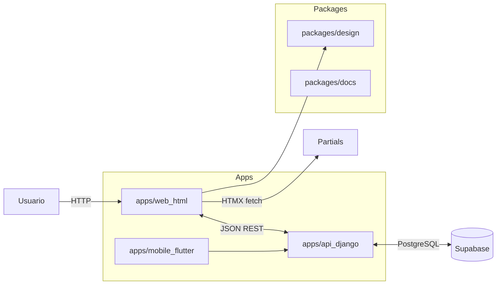

## Arquitectura (visión general)

- apps/web_html: Landing, auth y dash con Vite + Tailwind + HTMX.
- apps/api_django: API REST (DRF), JWT, CORS, /healthz, DB en Supabase.
- packages/design: tokens de diseño compartidos (CSS variables + tokens Tailwind).
- packages/docs: documentación y diagramas.

